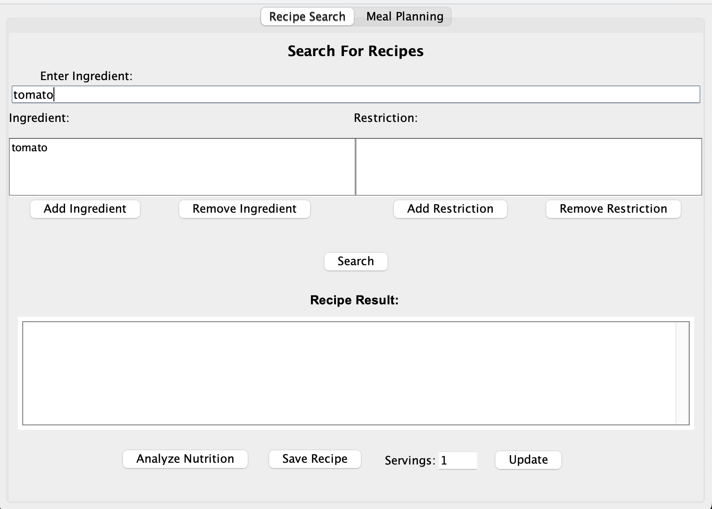
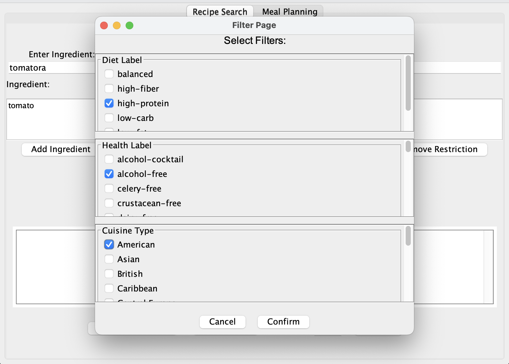
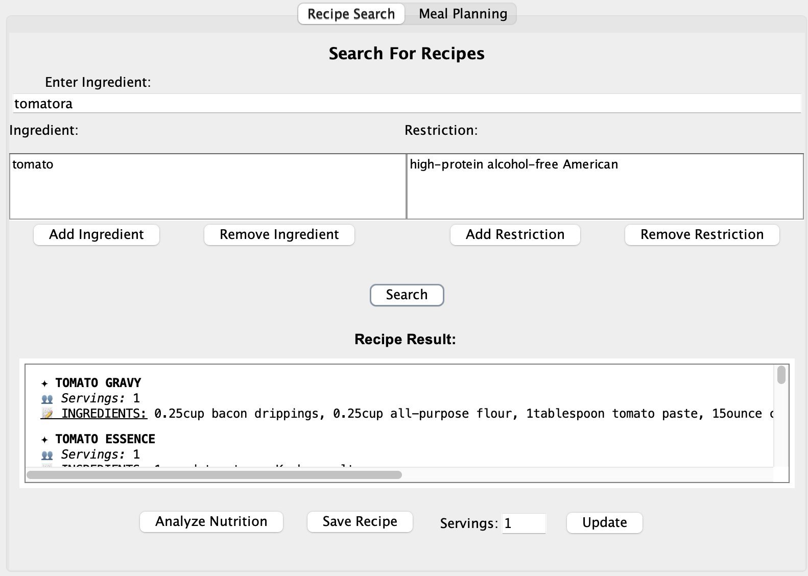
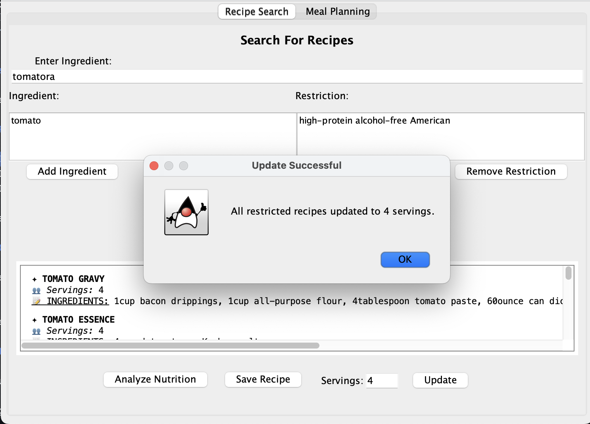
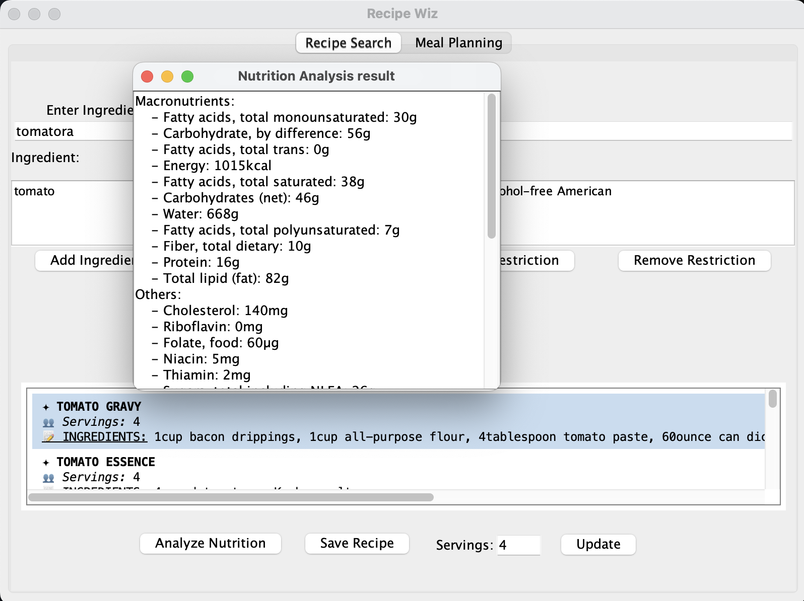
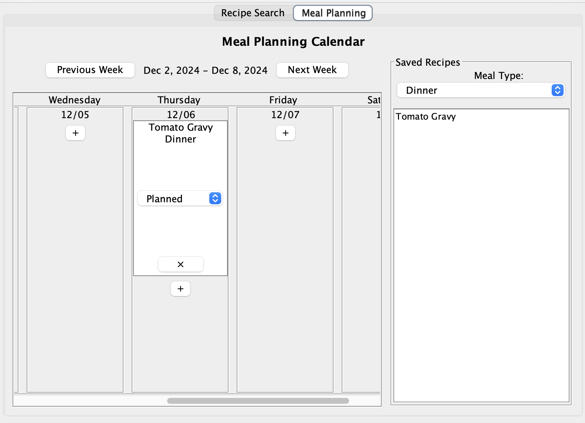

# Recipe Wiz

## Project Overview

Recipe Wiz is an innovative meal planning and recipe management application designed to simplify your cooking experience. It empowers users to discover recipes based on available ingredients, dietary preferences, or specific meal types. With features like nutritional analysis, a customizable meal planner, shopping list automation, and adjustable serving sizes, Recipe Wiz aims to make meal preparation both efficient and health-conscious.

## Contents

1. [Authors and contributors](#Authors-and-contributors)
2. [Key Features](#Key-Features)
2. [Installation Instructions](#Installation-Instructions)
3. [Usage Guide](#usage-guide)
4. [License](#License)
5. [Support and Feedback](#support-and-feedback)
6. [How to Contribute](#how-to-contribute)
7. [API USAGE](#API-USAGE)

## Authors and contributors
- Haris Anjum 
  - (@hanjum66)
- Jongyoon Baek 
  - (@KaiBaek)
- Xineng Na 
  - (@Alan-Na)
- Yujie Zeng 
  - (@Jerry-Zeng-UofT)

## Key Features

- **Smart Recipe Search**
    - Find recipes using ingredients you have on hand.
    - Filter results by meal types and dietary restrictions.
    - Leverage the Edamam Recipe API for a vast selection.

- **Detailed Nutritional Information**
    - Access comprehensive nutritional data for each recipe.
    - Includes calories, macronutrients, and other essential nutrients.

- **Personalized Meal Planner**
    - Schedule meals in a weekly calendar format.
    - Add, modify, or remove recipes from your plan easily.
    - Save your meal plans for future reference.

- **Adjustable Serving Sizes**
    - Modify recipes to fit the number of servings you need.
    - Automatic recalculation of ingredient amounts.

- **Dietary Preferences and Restrictions**
    - Apply filters for gluten-free, vegetarian, vegan, low-carb, and more.
    - Ensures all recipes meet your dietary needs.

## Installation Instructions

Before installing Recipe Wiz, ensure your system meets the following requirements:
1. **Java Development Kit (JDK) version 22 or higher**
    - Download the latest JDK from [Oracle](https://www.oracle.com/java/technologies/downloads/)

2. **Language Level**
   - Set the project language level to **16** in your IDE settings.

3. **Integrated Development Environment (IDE)**
    - Recommended: [IntelliJ IDEA](https://www.jetbrains.com/idea/download/).

### Installation Steps

1. **Clone main branch of the Repository**

   ```bash
   git clone https://github.com/Jerry-Zeng-UofT/Group-project-209.git
   
2. **Open the Project in IntelliJ IDEA**

   - Launch IntelliJ IDEA. Click on File > Open. Navigate to the cloned recipe-wiz directory and select it.
3. **Configure the JDK and Language Level**

   - Go to File > Project Structure. Under Project Settings > Project, set the Project SDK to your installed JDK 22 or higher. In the Project Structure dialog, under Project Settings > Modules, select your module. In the Sources tab, set the Language Level to 16 - Records, patterns, local enums and interfaces.
4. **Import Project Dependencies**

    - Since the project uses Maven, right-click on the pom.xml and select Maven > Reload Project

5. **Run the Application**

    -  In the Project Explorer, locate MainRecipeApplication.java and select Run ‘MainRecipeApplication.main()’. The application should start, and you can begin using Recipe Wiz.

### Common Installation Issues

1. **Dependency Resolution Problems**

    - Try refreshing the project dependencies: Right-click on the project and select Maven > Reload Project.


2. **Incorrect JDK Version**

    - In your IDE, ensure that the Project SDK is set to JDK 22 or higher. Check that individual modules are also set to use the correct SDK.


3. **Language Level Issues**

    - If you encounter errors related to language features, make sure the Project Language Level is set to 16. Go to File > Project Structure > Project, and set the Project Language Level accordingly. Also, check the Module Language Level under Project Settings > Modules.


## Usage Guide

The moment you run the program, you should see the front page view. If you click “Recipe Search” in that window, you'll be taken to a recipe search window, and if you click Meal planner, you'll see a meal planning calendar.


### How to use Recipe Search

1. You can add an ingredient to the ingredients panel by writing it in the ingredient field and hitting the add ingredient button. Conversely, you can remove an ingredient from the ingredients pane by selecting it in the ingredients panel and pressing the remove ingredient button.



2. You can filter your recipe search by pressing the add restriction button. This button will open a filter frame window where you can select Diet Label, Health Label, Cuisine Type, etc. in the pop-up window. You can remove a restriction from the restrictions panel by selecting it in the same way as remove ingredient and clicking the remove restriction button.



3. The Search button allows you to search for recipes based on the given ingredients and restrictions.



4. If you enter a number in the servings field and then update, the recipe results in the results panel will change to match the given servings value.



5. If the analyze nutrition button is pressed after selecting a specific recipe, the user can view the nutritional information for that specific recipe.



6. When you press the Save Recipe button, a specific recipe is saved to your meal planning calendar.


### How to use Meal Planner

1. Recipes saved from the recipe search bar will be available in the meal planning calendar, allowing users to customize their meal planning calendar.

2. Users can select different meal types and add recipes to the meal planning calendar to be eaten on the desired date.

3. Recipes saved in the meal planning calendar will remain as separate json files even after the program is terminated, and when the user runs the program again, the previously saved meal planning calendar will be loaded.



## License
- This project is licensed under the **MIT License**, which means you are free to:
  - Use the code for personal or commercial purposes.
  - Modify and distribute the code.
  - Include the code in proprietary software.


- However, you **must**:
  - Include the original copyright notice and this permission notice in any copies of the software.
  - Not hold the original authors liable for any damages arising from the use of the software.


- You can view the full text of the MIT License in the [LICENSE](./LICENSE) file included in this repository.
## Support and Feedback

We value your input and encourage you to provide feedback to help us improve Recipe Wiz. Here’s how you can share your thoughts and suggestions:

1. **GitHub Issues** 

    - Submit feedback, report bugs, or suggest new features by creating an issue in the GitHub [Issues](https://github.com/Jerry-Zeng-UofT/Group-project-209/issues) section.


2. **Discussion Board**

   - Join discussions with the community and developers in our GitHub [Discussions](https://github.com/Jerry-Zeng-UofT/Group-project-209/discussions)

### Feedback Guidelines

**Valid Feedback Includes**:

1. Clear descriptions of issues or suggestions.
2. Steps to reproduce bugs, if applicable.
3. Relevant screenshots, logs, or examples to support your points.

**What to Expect**

1. We aim to review and respond to feedback within 1 week.
2. Once verified, we will prioritize fixes based on severity.
3. Contributors who provide actionable feedback that results in improvements may receive acknowledgment in project updates.


## How to Contribute

We welcome contributions from the community to improve Recipe Wiz!

### Contribution Steps

1. **Fork the Repository**
    
    - Click the Fork button on the top-right corner of the repository page.

2. **Clone Your Fork**

    ```bash
   git clone https://github.com/your-username/Group-project-209.git
3. **Create a New Branch**

    - Create a branch where you make fixes.

4. **Implement your changes**

    - Fix bugs, create new features, or contribute code in your created branch from the previous step.

5. **Commit Your Changes**

    - After any changes, commit your changes with meaningful commit message.

6. **Push Your Changes**

7. **Submit a Pull Request**

   - Go to the original repository and click on New Pull Request. 
   - Provide a clear and detailed description of your changes.

## API Usage

In Recipe Wiz, we leverage the powerful **Edamam API** to enhance the user experience by providing comprehensive recipe search and nutritional analysis capabilities. Below is an overview of the APIs used and their functionality:

### 1. Recipe Search API

The **Recipe Search API** from Edamam is utilized to enable users to:

- Search for recipes based on ingredients, dietary restrictions, and meal types.
- Retrieve a rich dataset for each recipe, including:
    - Recipe title, image, and preparation steps.
    - Ingredients list with quantities.
    - Dietary labels (e.g., gluten-free, vegetarian).
    - Health labels (e.g., low-carb, keto-friendly).

This API ensures that Recipe Wiz provides tailored and diverse recipe suggestions for users with varying preferences and dietary needs.

### 2. Nutritional Analysis API

The **Nutritional Analysis API** from Edamam powers the nutritional information feature in Recipe Wiz. This API is used to:

- Analyze recipes to calculate detailed nutritional data, including:
    - Calories.
    - Macronutrients (protein, fat, carbohydrates).
    - Micronutrients (fiber, sugar, vitamins).
- Display easy-to-understand nutritional breakdowns for each recipe, helping users make informed dietary choices.

### API Documentation

For more details about the APIs used, refer to the official Edamam API documentation:

- [Recipe Search API Documentation](https://developer.edamam.com/edamam-recipe-api)
- [Nutritional Analysis API Documentation](https://developer.edamam.com/edamam-nutrition-api)

   


